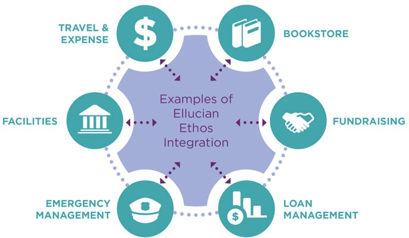

# Ethos Integration

> Updated: November 10, 2020
>
> Ellucian Ethos Integration acts as a data conduit between
> applications, allowing them to participate in a messaging enterprise
> that is configurable by each individual institution.
>
> Based on open standards and a microservices architecture, Ellucian
> Ethos Integration allows applications to integrate in real-time
> regardless of whether they are deployed on premises or in the cloud.

## Tenants, environments, and applications

> Updated: November 10, 2020
>
> The Ethos Integration tenant for your institution contains multiple
> Ethos Integration environments (Test, Production, and potentially
> others), and each environment contains multiple Ethos Integration
> applications.
>
> Tenants
>
> Within Ethos Integration, each institution has its own tenant.
> Multi-campus institutions might have multiple tenants, one for each
> campus.
>
> Environments
>
> Each tenant initially contains two Ethos Integration environments:
> Test and Production. You can license additional environments if needed
> to support your Ethos Integration implementation.
>
> Environments are independent - data exchanged between applications is
> contained within a single environment.
>
> Applications
>
> Within an environment, you create an Ethos Integration application for
> each software system that you want to share data through Ethos
> Integration. For example, you would likely create an application for
> your SIS (Banner or Colleague), and additional applications for other
> Ellucian products, third-party products, and your own custom
> applications. There is no limit on the number of applications within
> an environment.

## Data exchange methods in Ethos Integration

> Updated: November 10, 2020
>
> Ethos Integration supports the exchange of data through
> publish/subscribe, proxy API requests, and GraphQL requests.

### Publish and subscribe

> Updated: November 10, 2020
>
> With publish/subscribe, one application publishes change notifications
> to Ethos Integration and other applications retrieve and process those
> changes.
>
> An application that owns an Ethos resource (the authoritative
> application) is responsible for publishing change notifications for
> changes related to that resource to Ethos Integration. For example, an
> application that owns the persons resource (typically Banner or
> Colleague) publishes changes to person information. Other applications
> can subscribe to those changes. Ethos Integration queues the change
> notifications for subscribing applications, and the subscribing
> applications retrieve and process the change notifications that have
> been queued for them.
>
> Example: Publish and subscribe

1.  The Student Information System authenticates with Ellucian Ethos
    Integration and receives a session token response.

2.  The Student Information System authenticates using the session token
    to publish change notifications to Ellucian Ethos Integration.

3.  Ellucian Ethos Integration queues the message for interested
    subscribers.

4.  Ellucian CRM Advise and Ellucian Elevate authenticate with Ellucian
    Ethos Integration and receive a session token response.

5.  Ellucian CRM Advise and Ellucian Elevate invoke the Message Queue
    > service to retrieve change notifications.

### Proxy API requests

> Updated: November 10, 2020
>
> With proxy API requests, one application can read or modify data in an
> authoritative application by making a call through Ethos Integration
> to the Ethos APIs of the authoritative application.
>
> The Proxy service provides a layer of indirection so that
> non-authoritative applications do not need to know which application
> is authoritative for the resource. Making requests of resources
> through the Proxy service is similar to making direct requests without
> Ellucian Ethos Integration. The payload of a request is a properly
> formatted Ellucian Ethos Data Model entity (or defined custom
> resource). The same methods are used to create (POST), retrieve (GET),
> update (PUT), and delete (DELETE) resources, with the following
> differences.
>
> Credentials
>
> While Ellucian Ethos Integration prevents applications from having to
> know what application is authoritative for a given resource, Ellucian
> Ethos Integration administrators must know to configure Ellucian Ethos
> Integration correctly.
>
> Proper configuration is based on the following principles:

-   In addition to publishing change requests for resources for which
    they are authoritative, authoritative applications are expected to
    expose APIs for CRUD operations -- Create, Read, Update, Delete --
    on those resources.

-   APIs exposed by authoritative applications are governed by the
    applications' security policies; each application is responsible for
    securing access to its APIs.

-   HTTP basic auth is the lowest common denominator for authenticating
    requests from client applications. Consequently, service requests
    are expected to include an established set of credentials.

-   To eliminate the need for applications to store credentials locally
    for every application whose resources need to be invoked,
    maintenance of application credentials has been centralized in
    Ellucian Ethos Integration. Each application record can store
    credentials for the applications whose resources need to be invoked.

> Access Token
>
> Invoking resources through Ellucian Ethos Integration requires the
> inclusion of an access token in the Authorization header.
>
> Use Cases
>
> Example Ellucian Ethos Data Model Proxy API Service use cases include:

-   Create client application data - A client application creates a new
    grade, but is not authoritative for grades. It issues a POST request
    against the Proxy API Service, including a null ID in the Ellucian
    Ethos Data Model object. The Proxy API identifies the authoritative
    system for grades and routes the request there. The authoritative
    system updates its data, assigns an ID (GUID), and issues a response
    to the Proxy API Service.

-   Update client application data - A client application modifies data
    for a grade, but is not authoritative for grades. It issues a PUT
    request against the Proxy API Service, which identifies the system
    that is authoritative for grades. It routes the request to that
    system, which updates its data and responds to the Proxy AP Service,
    and routes the response to the client application. The authoritative
    system is then responsible for publishing the change to Ellucian
    Ethos Integration by way of a change notification.

-   Request client application data - A client application needs to know
    more information about a person. The client application issues a GET
    request for the person based on an Ellucian Ethos Data Model ID on
    the Proxy API Service. The Proxy API Service identifies the
    authoritative system for the person and routes the request there.
    The authoritative system builds the Ellucian Ethos Data Model object
    and returns it in the response.

#### Example: Proxy API request

> Updated: November 10, 2020
>
> The following is an example of how the Ellucian Ethos Integration
> Proxy API service facilitates request/reply messaging between
> non-authoritative client applications and authoritative systems.
>
> 

1.  Ellucian Elevate authenticates with Ellucian Ethos Integration and
    receives a session token response.

2.  Ellucian Elevate uses the session token to call the Proxy API
    service and requests information.

3.  Ellucian Ethos Integration determines the authoritative application
    is the Student Information System and routes the request to the
    Student Information System's RESTful API.

4.  The Student Information System's API receives the request, processes
    it, and responds.

5.  Ellucian Ethos Integration returns the response to Ellucian Elevate.

### GraphQL requests

> Updated: November 10, 2020
>
> With GraphQL requests, data from the authoritative application is
> loaded into Ellucian Ethos Data Access, and other applications can
> read that data by making GraphQL requests through Ethos Integration to
> Data Access.
>
> These requests use GraphQL, an open-source language and tool for
> querying data.
>
> To retrieve data through Ethos Integration, you can use either GraphQL
> requests to Data Access or proxy API requests to the Ethos APIs of the
> authoritative source. In deciding which of these methods to use in
> your own applications, consider the following:

-   The key benefit of GraphQL requests is improved performance. GraphQL
    requests can retrieve, in one request, data that would require
    multiple proxy API requests to the Ethos APIs. For example, consider
    retrieving a section roster. For a proxy API call to get all
    students in a section, you would need to write code that calls
    multiple Ethos APIs such as sections, section- registrations, and
    persons. With GraphQL, you can design a query that is executed one
    time, and data is returned from a highly-performant cloud data lake
    (Data Access).

-   GraphQL requests require setting up the authoritative source (such
    as Banner or Colleague) to load the required data into Data Access.

-   GraphQL requests support only reading data. Any requests to modify
    data will continue to use proxy API calls.

> GraphQL requests provide the same data security capabilities as proxy
> API requests. When you set up an application to make GraphQL requests
> to Data Access, you specify the Ethos resources to which that
> application has access. You can also restrict specific properties. For
> example, you could specify that an application can access data in the
> persons resource, but deny access to social security number.

## Responsibilities of participating applications

> Updated: November 10, 2020
>
> Applications that participate in Ethos Integration have specific
> responsibilities.
>
> Responsibilities of an authoritative source application
>
> Authoritative applications must both publish data changes and respond
> to requests for data.
>
> To support the publish/subscribe workflow, authoritative applications
> are responsible for publishing *change notifications* to Ethos
> Integration for resources for which they are authoritative. They
> always publish a change notification containing the most recent
> version of the Ellucian Ethos Data Model
>
> To support requests for data, authoritative applications must respond
> to request and reply messaging through the Ethos Integration Proxy API
> Service by way of their RESTful APIs. They are responsible for
> exposing both the most recent version and prior supported versions of
> Ellucian Ethos Data Model resources through their RESTful APIs.
>
> Responsibilities of a subscribing application
>
> Subscribing applications are not authoritative for a particular
> resource, although they may be authoritative for other resources. To
> keep the subscribing application's data store synchronized with the
> application that is authoritative for the resource, subscribing
> applications are responsible for retrieving and processing change
> notifications that have been queued for them. They retrieve change
> notifications through the Ellucian Ethos Integration Message Queue
> service.
>
> As non-authoritative systems -- at least for specific resources --
> subscribing applications additionally might request specific data by
> issuing Create, Read, Update, or Delete (CRUD) requests on resources
> through the Ethos Integration Proxy API service, or Read requests to
> Ellucian Ethos Data Access through the GraphQL service.

## Ellucian Ethos Integration requests

> Updated: November 10, 2020
>
> Individuals with access to the administrative interface of Ellucian
> Ethos Integration can configure and monitor the flow of messages
> between integrated applications.
>
> To gain access to the Ellucian Ethos Integration environments for your
> institution, you must:

1.  Obtain an Ellucian Customer Center account.

2.  Request access to Ellucian Ethos Integration.

### Obtain an Ellucian Customer Center account

> Updated: November 10, 2020
>
> An Ellucian Customer Center account ensures that you are associated
> with one or more institution in the Ellucian CRM system, and that you
> have an account with Okta, the identity provider for Ellucian.
>
> Before you begin
>
> To confirm that you have a Customer Center account, go to
> <https://clientapps.ellucian.com/signup>. If you have already
> registered with that email address, you will receive a message that
> the record was found. Or you can submit a case by sending an email to
> <csenablement@ellucian.com> and Ellucian can verify the account.
>
> Procedure

1.  Go to [login.ellucian.com](https://login.ellucian.com/).

2.  Click **Sign up for an account.**

3.  Enter the email address provided to you by your institution and
    complete the CAPTCHA requirements.

4.  Click **Submit**.

> Result: A registration email generates from <no-reply@okta.com>.
> Ensure you are not blocking this email address or domain, or that the
> email is not in your spam folder.

5.  When you receive the registration email, confirm your registration,
    and set your password.

### Request access to Ellucian Ethos Integration

> Updated: November 24, 2020
>
> After you confirm that you have access to the Ellucian Customer
> Center, you request access to Ellucian Ethos Integration.
>
> Procedure

1.  Click the main menu in the top right corner of the window.

2.  Click **View Options and Request App Access** in the footer.

3.  Follow the prompts to request access.

4.  Optional: If you are a new registrant, or want to add access, select
    **Request Case Access** or

##### Request Downloads Access here.

> What to do next
>
> The responsible party at your institution must approve access
> requests. This is similar to requests for code download, or the Client
> Invoice Portal.
>
> The approver at your institution will be able to deny or approve the
> request.
>
> When Ellucian receives a decision, the requester receives access to
> Ethos Integration, and an update to the case informs the requestor
> that access is now available.
>
> For individuals who receive access, a **Integration** link appears in
> the Customer Center under

##### Tools \> Ethos \> Integration.

## Banner and Colleague messaging components

> Updated: November 10, 2020
>
> This section provides an overview of the software components that
> collaborate to connect Banner or Colleague to Ellucian Ethos
> Integration.
>
> Connecting Banner or Colleague to Ellucian Ethos Integration requires
> additional software components. The following components work together
> to adapt the applications to the messaging model and data format used
> by Ellucian Ethos Integration.

-   The application\'s Ellucian Ethos Data Model APIs.

-   The application\'s event generator:

    -   Banner Event Publisher (BEP) for Banner.

    -   Envision Data Exchange (EDX) for Colleague.

-   The Ellucian Messaging Service.

-   The Ellucian Message Adapter.

> All of these software components are available on the Ellucian
> Download Center or SA Valet for Colleague clients, and require no
> additional licensing.
>
> The following diagram shows the individual software components and
> their use in the publish/ subscribe and request/reply messaging.

> Ellucian Ethos Data Model APIs
>
> The Ellucian Ethos Data Model APIs simplify and standardize
> integration with external applications by exposing Banner or Colleague
> data in the common Ellucian Ethos Data Model format.
>
> The APIs enable request/reply messaging from external systems through
> the Proxy service of Ellucian Ethos Integration. The request/reply
> messaging flow is shown by the blue arrows and numbers in the diagram
> above. The APIs are also used by the Ellucian Message Adapter when it
> publishes change notifications to the Publisher service of Ellucian
> Ethos Integration. The publish and subscribe messaging flow is shown
> by the green arrows and numbers in the diagram.
>
> The Ellucian Ethos Data Model APIs for Colleague are included in the
> Colleague Web API beginning with release 1.11. The Ellucian Ethos Data
> Model APIs for Banner are included in separate API packages for each
> functional area beginning with Banner Student 9.5.
>
> Note: New APIs continue to be added and you should upgrade your API
> installations to take advantage of the latest integration
> capabilities.
>
> Event Generator (BEP or EDX)
>
> The event generators monitor database changes and trigger publication
> of messages to external systems. The event generator for Banner is the
> Banner Event Publisher (BEP). The event generator for Colleague is
> Envision Data Exchange (EDX).
>
> The event generators publish data changes as rapidly as possible. They
> publish data as generic business events that contain only a limited
> amount of data to make them efficient and allow them to be used for a
> variety of integrations. A separate software component is required to
> turn these generic business events into a message that has relevance
> to an external application. Message queuing software is used to avoid
> tight coupling between the event generator and the software that
> processes the business events.
>
> Ellucian Messaging Service
>
> The Ellucian Messaging Service is message queuing software that
> decouples the event generator for Banner or Colleague from the
> software that processes the business events. Business events created
> by BEP or EDX are published to a defined queue in the Ellucian
> Messaging Service and are read by the software that processes business
> events asynchronously, but in the order in which they occurred. This
> allows the event generator and the software that processes business
> events to work at their own pace while maintaining the original order
> in which data changes occurred.
>
> Ellucian Message Adapter
>
> The Ellucian Message Adapter is the common software component that
> publishes data changes from Banner or Colleague to Ellucian Ethos
> Integration. Publishing change notifications is a requirement for
> these applications when they are configured as authoritative for
> Ellucian Ethos Data Model entities.
>
> The Ellucian Message Adapter requires several other components to
> operate. The Ellucian Ethos Data Model APIs must be installed and
> available to the Ellucian Message Adapter for it to retrieve the
> appropriate Ellucian Ethos Data Model format to publish. The Ellucian
> Message Adapter is also dependent on the Ellucian Messaging Service
> and the event generator for Banner or Colleague. These components
> notify the Ellucian Message Adapter to publish a change notification
> whenever data in Banner or Colleague changes.
>
> Understanding the Message Flow
>
> The diagram above shows both the request/reply and the publish and
> subscribe messaging flow through Ellucian Ethos Integration.
>
> The blue arrows show a service invocation being made to the Proxy
> service by an external application that is not authoritative for an
> Ellucian Ethos Data Model entity (1). Based on the configuration, the
> Proxy service forwards the request to the exposed API of the
> application that is authoritative for the entity in the request (2).
> The response that is returned to the Proxy service (3) is sent to the
> application that originated the service invocation (4).
>
> The green arrows show the publish and subscribe flow which involves
> all of the messaging components. BEP or EDX is responsible for
> monitoring Banner or Colleague for data changes. The event generator
> posts a data change to the Ellucian Messaging Service (EMS) in a
> defined
>
> business event format (1). The Ellucian Message Adapter (EMA) is a
> consumer of the business event message published by BEP or EDX (2).
> When the EMA consumes a business event, it invokes the appropriate
> Banner or Colleague API (3) to get the full representation of the
> associated Ellucian Ethos Data Model entity (4). The EMA then posts
> the full representation of the entity to the Publisher service of
> Ellucian Ethos Integration (5). The Publisher service is responsible
> for publishing the change notification to the respective queues of
> Subscriber applications defined in the tenant\'s Configuration
> database. Non-authoritative applications that subscribe to change
> notifications for specific entities are responsible for polling the
> Message Queue service (6) to retrieve change notifications in their
> queue (the lines show the retrieval of queued messages by the
> consuming application).
>
> Note: The arrows in the diagram depict the flow of data, not
> necessarily action on the part of components.

## Support for multiple ownership of resources

> Updated: November 10, 2020
>
> In Ellucian Ethos Integration, multiple authoritative sources can own
> the same resource.
>
> For each Ethos data model, there is generally one application that is
> logically responsible for maintaining the data in the data model.
> However, in some cases, multiple applications, or multiple instances
> of an application, maintain the same data. Use cases include:

-   Multiple vendors manage the same information

-   Multiple instances of a vendor application

-   Banner Multi-Entity Processing (MEP)

> This section provides a description of multiple ownership. See the
> links below for the procedures for implementing multiple ownership.
>
> Related concepts

-   [Set up Banner in Ethos Integration
    > (MEP)](https://resources.elluciancloud.com/bundle/ethos_integration_lrn_getstarted/page/c_set_up_banner_ethos_int_mep.html)

-   [Set up applications in Ethos Integration (multiple
    > owners)](https://resources.elluciancloud.com/bundle/ethos_integration_lrn_getstarted/page/c_set_up_app_ethos_int_multi_owner.html)

### Multiple owner use cases

> Updated: November 10, 2020
>
> The multi-owner capability of Ellucian Ethos Integration supports
> situations where more than one application is responsible for the data
> in a data model.
>
> Several use cases are described below. These descriptions show only
> the authoritative applications. For an example that shows both the
> authoritative applications and an application that accesses the data,
> see [Example: Banner MEP and Campus Card
> System](#example-banner-mep-and-campus-card-system).
>
> Multiple vendors manage the same information
>
> Example: You use two vendor applications that both manage events on
> campus. Each vendor application maintains information about the events
> that it manages, so each needs to own the Ethos resources related to
> events (including, for example, the constituent-event-participations
> resource).

> Multiple instances of a vendor application
>
> Example: You use a vendor application that manages events on campus.
> You have installed two instances of that vendor application, one to
> manage events on the Main Campus and one to manage events on the North
> Campus. Each instance of the vendor application maintains information
> about the events that it manages, so each needs to own the Ethos
> resources related to events (including, for example, the
> constituent-event-participations resource).

> Banner Multi-Entity Processing (MEP)
>
> Example: You have set up Banner MEP with two instances: Main Campus
> and North Campus. Each instance maintains information about its
> campus, so each needs to own all of the Ethos resources for which
> Banner is responsible (including, for example, the email-types
> resource).
>
> 
>
> Note: Banner requires two Ethos Integration applications for each MEP
> instance, one for the Integration API and another for the Student API,
> and also requires applications for shared resources. For simplicity,
> the diagram shows only the Integration API applications for each
> instance.

### Ethos Integration capabilities that support multiple ownership of resources

> Updated: November 10, 2020
>
> The setup of resource ownership, subscriptions, and proxy API requests
> all support multiple ownership of resources.

+--------------+-------------------------------------------------------+
| > Feature    | > Ethos Integration multi-owner capability            |
+==============+=======================================================+
| > Resource   |                                                       |
| > ownership  |                                                       |
| > Multiple   |                                                       |
| >            |                                                       |
| applications |                                                       |
| > can own    |                                                       |
| > the same   |                                                       |
| > resource.  |                                                       |
| > One        |                                                       |
| >            |                                                       |
|  application |                                                       |
| > is the     |                                                       |
| > default    |                                                       |
| > owner. The |                                                       |
| > first      |                                                       |
| >            |                                                       |
|  application |                                                       |
| > to which   |                                                       |
| > you assign |                                                       |
| > a resource |                                                       |
| > is         |                                                       |
| > initially  |                                                       |
| > the        |                                                       |
| > default    |                                                       |
| > owner, but |                                                       |
| > you can    |                                                       |
| > specify a  |                                                       |
| > different  |                                                       |
| > default    |                                                       |
| > owner for  |                                                       |
| > a          |                                                       |
| > resource.  |                                                       |
+--------------+-------------------------------------------------------+
| > S          |                                                       |
| ubscriptions |                                                       |
| > When you   |                                                       |
| > assign     |                                                       |
| > s          |                                                       |
| ubscriptions |                                                       |
| > to a       |                                                       |
| > consuming  |                                                       |
| >            |                                                       |
| application, |                                                       |
| > all of the |                                                       |
| > instances  |                                                       |
| > of a       |                                                       |
| > resource   |                                                       |
| > (from all  |                                                       |
| > owners)    |                                                       |
| > are        |                                                       |
| > available  |                                                       |
| > for        |                                                       |
| > selection. |                                                       |
| > You select |                                                       |
| > the        |                                                       |
| >            |                                                       |
|  appropriate |                                                       |
| > instance   |                                                       |
| > for this   |                                                       |
| >            |                                                       |
| application. |                                                       |
+--------------+-------------------------------------------------------+
| > Proxy API  |                                                       |
| > requests A |                                                       |
| > consuming  |                                                       |
| >            |                                                       |
|  application |                                                       |
| > can make   |                                                       |
| > proxy API  |                                                       |
| > requests   |                                                       |
| > to the     |                                                       |
| > owner of a |                                                       |
| > resource.  |                                                       |
| > When a     |                                                       |
| > resource   |                                                       |
| > is owned   |                                                       |
| > by         |                                                       |
| > multiple   |                                                       |
| > a          |                                                       |
| uthoritative |                                                       |
| > sources,   |                                                       |
| > you can    |                                                       |
| > create a   |                                                       |
| > *resource  |                                                       |
| > request*   |                                                       |
| > to specify |                                                       |
| > which      |                                                       |
| > a          |                                                       |
| uthoritative |                                                       |
| > source the |                                                       |
| > proxy API  |                                                       |
| > request    |                                                       |
| > goes to.   |                                                       |
| > Proxy API  |                                                       |
| > requests   |                                                       |
| > go to the  |                                                       |
| > default    |                                                       |
| > owner of a |                                                       |
| > resource   |                                                       |
| > unless you |                                                       |
| > create a   |                                                       |
| > resource   |                                                       |
| > request.   |                                                       |
+--------------+-------------------------------------------------------+

### Example: Banner MEP and Campus Card System

> Updated: November 10, 2020
>
> This example shows both the authoritative application (Banner) and a
> Campus Card System application that needs access to Banner-owned
> resources.
>
> The Campus Card System needs access to building information that is in
> the housing- assignments data model, so that it can control access to
> campus housing. Banner is authoritative for the housing-assignments
> data model.
>
> One-to-one relationship between authoritative and consuming
> applications
>
> This first example assumes that you have installed two instances of
> the Campus Card System application, one for each campus. In this
> example, the Main Campus instance of the Campus Card System
> application needs access to data in the Main Campus MEP instance,
> while the North Campus instance of the Campus Card System application
> needs access to data in the North Campus MEP instance.

> Note: Banner requires two Ethos Integration applications for each MEP
> instance, one for the Integration API and another for the Student API,
> and also requires applications for shared resources. For simplicity,
> the diagram shows only the Integration API applications for each
> instance.
>
> To support this, you would do the following:

1.  Create the following Ethos Integration applications:

    -   Banner Main Campus Integration API

    -   Banner Main Campus Student API

    -   Banner North Campus Integration API

    -   Banner North Campus Student API

    -   Campus Card System Main Campus

    -   Campus Card System North Campus

2.  Assign resources to the four Ethos Integration applications for
    Banner. The housing- assignments data model would be owned by both
    the Banner Main Campus Integration API application and the Banner
    North Campus Integration API application.

3.  If you want the Campus Card System to subscribe to Banner-published
    changes for housing assignments:

    -   Set up subscriptions for the Main Campus:

> \-
>
> \-
>
> authentication token.

-   Use the same process to set up a subscription from the Campus Card
    System North Campus instance to changes published by Banner North
    Campus.

> a
>
> d by at is

ieve the

4.  If you want the Campus Card System to make proxy API requests to
    Banner for housing assignments data:

    -   Set up proxy API requests for the Main Campus:

> \-
>
> \-
>
> authentication token.

up uest to (not

> ke the

-   Use the same process to set up proxy API requests from the Campus
    Card System North Campus to Banner North Campus.

> Many-to-one relationship between authoritative and consuming
> applications
>
> This example assumes that you have installed one instance of the
> Campus Card System application, which needs access to data in both the
> Main Campus and North Campus Banner applications.

> Note: Banner requires two Ethos Integration applications for each MEP
> instance, one for the Integration API and another for the Student API,
> and also requires
>
> applications for shared resources. For simplicity, the diagram shows
> only the Integration API applications for each instance.
>
> To support this, you would do the following:

1.  Create the following Ethos Integration applications:

    -   Banner Main Campus Integration API

    -   Banner Main Campus Student API

    -   Banner North Campus Integration API

    -   Banner North Campus Student API

    -   Campus Card System Main Campus

    -   Campus Card System North Campus

> Note that you create two Ethos Integration applications for the Campus
> Card System, even though there is only one instance of the Campus Card
> System itself.

2.  Assign resources to the four Ethos Integration applications for
    Banner. The housing- assignments data model would be owned by both
    the Banner Main Campus Integration API application and the Banner
    North Campus Integration API application.

3.  If you want the Campus Card System to subscribe to Banner-published
    changes for housing assignments:

    -   Set up subscriptions for the Main Campus:

        -   In t sub two ow

        -   Set thr

> pus, add a
>
> e is owned by source that is
>
> ifications pplication for
>
> Campus Card System Main Campus when generating the authentication
> token.

-   Use the same process to set up a subscription from the Campus Card
    System to changes published by Banner North Campus.

4.  If you want the Campus Card System to make proxy API requests to
    Banner for housing assignments data:

    -   Set up proxy API requests for the Main Campus:

        -   In the Ethos Integration application for Campus Card System
            Main Campus, set up proxy API requests to the
            housing-assignments resource. Create a resource request to
            ensure that the proxy API request goes to Banner Main Campus
            Integration API (not required if Banner Main Campus
            Integration API is the default owner of housing-
            assignments).

        -   Set up the Campus Card System application itself to make
            proxy API requests through Ethos Integration, using the API
            key for the Ethos Integration application for Campus Card
            System Main Campus when generating the authentication token.

    -   Use the same process to set up proxy API requests from the
        Campus Card System to Banner North Campus.

## Data security

> Updated: November 10, 2020
>
> Protecting sensitive data is imperative for modern enterprises, as
> attackers find increasingly innovative ways to compromise systems and
> steal data.
>
> Ellucian provides technology and features that are designed to keep
> your data secure. Encryption plays a major role in data protection,
> securing data both in transit and at rest.

### Data sovereignty

> Updated: November 10, 2020
>
> To help comply with varying data sovereignty requirements from region
> to region, Ellucian provides a cloud solution in a number of
> geographic regions.
>
> These regions include:

-   United States

-   Canada

-   Europe

-   Asia-Pacific

> Refer to [Ethos Integration domains and IP
> addresses](https://resources.elluciancloud.com/csh?topicname=r_region_domain_ip_addresses)
> for information regarding calls to the Ethos Integration APIs to
> include the region-specific domain.

### Communication hub

> Updated: November 10, 2020
>
> Ethos Integration is the communication hub that allows central access
> to facilitate communication with many different systems.
>
> Ethos Integration defines which applications are authoritative for
> resources and applications that subscribe to Ellucian Ethos Data Model
> changes.
>
> Applications that want to invoke Ethos APIs require a credential for
> Ethos Integration to authenticate to the authoritative system.
>
> Ethos Integration provides applications an API key, which is used to
> authenticate to Ethos Integration.
>
> Ethos Integration is in control of defining what information
> applications are allowed to access. The administrator who configures
> Ethos Integration on behalf of the authoritative system needs to
> understand the security controls for the authoritative system to be
> able to set up those applications in a secure manner.

### API key authentication

> Updated: November 10, 2020
>
> Ethos Integration generates an API key for each application when
> application definitions are created on the Ethos Integration Admin
> console. These API keys are used to uniquely identify each application
> in the given tenant environment.
>
> Each integrated application uses its API key to authenticate with
> Ethos Integration, which returns an access token in JSON Web Token
> (JWT) format required to invoke APIs. Refer to [Invoke
> the](https://resources.elluciancloud.com/bundle/ethos_integration_lrn_getstarted/page/t_invoke_authentication_service.html)
> [Authentication service to get an access
> token](https://resources.elluciancloud.com/bundle/ethos_integration_lrn_getstarted/page/t_invoke_authentication_service.html).
>
> Ellucian recommends that you set up an API key expiration policy, just
> as you have a password expiration policy. If an API key is potentially
> exposed, shared, or stolen, you should generate a new API key.

### Privacy controls

> Updated: November 10, 2020
>
> If access to the API is invoked, the authoritative system returns a
> data model supporting the authoritative source security requirements,
> which might remove properties that are considered personally
> identifiable information (PII).
>
> An authoritative system might remove properties from a data model that
> are considered sensitive, or PII. Ethos Integration delegates API
> security to the authoritative system.

### Shared responsibility model

> Updated: November 10, 2020
>
> Ellucian and our users follow the shared responsibility model to
> ensure data is secure.

#### Ellucian

> Updated: November 10, 2020
>
> Ellucian provides capabilities within the Ethos API application
> toolset to restrict access to data and filter data model properties on
> a per-application basis.
>
> Ellucian implements Amazon Web Services (AWS) security best practices.
> All Ellucian cloud solutions have the same logging format, enabling
> Ellucian to track when applications request data. This enables
> Ellucian to support audit and incident management requests.
>
> Configuration
>
> Applications integrated through the Ellucian Ethos Platform are
> allowed access only to the data that the client authorizes them to
> access. This is controlled in Ethos Integration and in the
> authoritative system's security implementation.
>
> Secure data in transit
>
> Data in transit, or data in motion, is data actively moving from one
> location to another such as across the internet or through a private
> network. Data protection in transit is the protection of this data
> while it is traveling from network to network or being transferred
> from a local storage device
>
> to a cloud storage device. Wherever data is moving, effective data
> protection measures for in- transit data are critical as data is often
> considered less secure while in motion.
>
> All applications that connect to Ethos Integration to make data
> requests must use safe encryption technology TLS 1.1 or 1.2 protocols.
> This includes Ellucian cloud-native applications.
>
> Secure data at rest
>
> Data at rest is data that is not actively moving from device to device
> or network to network, such as data stored on a hard drive, laptop,
> flash drive, or stored in some other way. Data protection at rest aims
> to secure inactive data stored on any device or network. While data at
> rest is sometimes considered to be less vulnerable than data in
> transit, attackers often find data at rest a more valuable target than
> data in motion. The risk profile for data in transit or data at rest
> depends on the security measures that are in place to secure data in
> either state.
>
> All data that is queued in the Ethos Cloud, waiting for subscribing
> systems to collect, is encrypted at rest. Data is encrypted at rest
> with AWS storage encryption.

#### The user

> Updated: November 10, 2020
>
> Every application definition in Ethos Integration should have a
> separate credential to the authoritative system. That is the only way
> to track what the applications do.
>
> The API key is a sensitive credential and should not be shared.
> Ellucian recommends that you define an API Key expiration policy.
>
> Ellucian recommends that you support a least-privileged-access
> security model. Define rules for the application and what APIs are
> accessible to an application and, if accessible, what operations users
> can perform (such as read versus write access). Define content
> filtering rules that are applicable for every application requesting
> data. For normal abilities, personally identifiable information (PII)
> data is often not needed and can be filtered.

# Ethos Integration components and terminology

> Updated: November 10, 2020
>
> You may need additional information about Ellucian Ethos Integration.

## What is Ellucian Ethos Integration?

> Updated: November 10, 2020
>
> The cloud-native Ellucian Ethos Integration leverages Amazon Web
> Services. You can use it to provide a single *hub* that interacts with
> RESTful APIs, and to subscribe and publish Ellucian Ethos Data Model
> data changes.
>
> Ellucian Ethos Integration uses the following concepts:

-   [Amazon Web Services](http://aws.amazon.com/)

-   [RESTful APIs](https://github.com/restfulapi/api-strategy)

-   Ellucian Ethos Data Model data changes

## What are the Ellucian Ethos Integration participation guidelines?

> Updated: November 10, 2020
>
> Ellucian Ethos Integration supports two system application messaging
> flows. There are authoritative and non-authoritative messaging flows.
>
> *Publish and Subscribe* messaging involves publishing changed entities
> to Ellucian Ethos Integration, which is responsible for delivering a
> change notification to a queue for each configured subscriber of the
> resource that was changed.
>
> *Request and Reply* messaging is a means by which applications can
> make requests of resources and Ellucian Ethos Integration can proxy
> those requests to an application that is authoritative for the
> resource.

## What are RESTful APIs?

> Updated: November 10, 2020
>
> Ellucian Ethos Integration uses a set of RESTful APIs.
>
> An API is a specification used as an interface by software components
> to communicate with each other. REpresentational State Transfer (REST)
> is a set of principles that define how web standards, such as HTTP and
> URI, are to be used. APIs that adopt REST principles are stateless and
> resource-orientated, expose a uniform interface, and use hypermedia as
> the engine of application state. The client interacting with an
> application is provided with appropriate options at each step within a
> work flow.
>
> RESTful APIs have the following characteristics:

-   They expose resources to represent important concepts and objects.

-   They ensure that each resource is uniquely addressable by way of a
    URI, so that clients can interact with them over HTTP.

-   They expose one or more representation (for example, using JSON or
    > XML) of those resources.

-   They provide a consistent, standard interface based on standard HTTP
    methods.

-   They ensure that interaction with the API is stateless in nature to
    provide flexibility in deployment to promote scalability.

-   They use hypermedia as the engine of application state.

## What is the Ellucian Ethos Data Model?

> Updated: November 10, 2020
>
> The Ellucian Ethos Data Model is a single model of all of the concepts
> in the entire domain of higher education.
>
> Each concept is a separate entity in the model, and the same name is
> used by both business and technical audiences. The model is expressed
> in the form of JSON Schema documents. All Ellucian applications and
> third-party certified partner applications are required to support the
> Ellucian Ethos Data Model for system integration purposes.
>
> Related concepts
>
> [About the Ellucian Ethos Data
> Model](https://resources.elluciancloud.com/csh?topicname=c_about_eedm)

## What are the roles and responsibilities for authoritative systems supporting the Ellucian Ethos Data Model?

> Updated: November 10, 2020
>
> Authoritative systems must implement Ellucian Ethos Data Model RESTful
> APIs using the following standards.

-   Ellucian Ethos Data Model APIs require support for GET, PUT, POST,
    DELETE, and PATCH operations.

-   Authoritative systems must support all properties.

> Note: This includes optional properties that may not currently exist
> in the authoritative source.

-   The authoritative source must be a good Ellucian Ethos Data Model
    citizen and support storing and publishing all Ellucian Ethos Data
    Model data.

-   Authoritative systems must publish Ellucian Ethos Data Model data
    changes to Ellucian Ethos Integration regardless of how
    authoritative source data changes occur.

## What are the roles and responsibilities for non-authoritative systems supporting the Ellucian Ethos Data Model?

> Updated: November 10, 2020
>
> Non-authoritative systems can subscribe to Ellucian Ethos Data Model
> data changes.
>
> Non-authoritative systems should never publish an Ellucian Ethos Data
> Model data change to Ellucian Ethos Integration. because the
> application is not authoritative for this data, it should not publish
> a data change that could be rejected by the authoritative system and
> cause data inconsistency for all subscribing applications.
> Non-authoritative systems must invoke Ellucian Ethos Data Model
> RESTful APIs through the Ellucian Ethos Integration Proxy API end
> point to manipulate Ellucian Ethos Data Model data. This is a
> synchronous API call that is fulfilled by the authoritative system.
> The response will indicate if the API operation succeeded or failed.
> Non- authoritative systems should not publicly expose Ellucian Ethos
> Data Model RESTful APIs because they are not the authoritative
> systems. They may implement Ellucian Ethos Data Model APIs for their
> internal use only.

## What is an API key?

> Updated: November 10, 2020
>
> An *API key* is a code passed in by the programs calling an API to
> identify the calling program, its developer, or its user to the
> website.
>
> API keys track and control API details and use. An API key can act as
> a unique identifier and a secret token for authentication, and
> generally has a set of access rights on the API associated with it.
> Ellucian Ethos Integration services, such as publish, subscribe, or
> proxy, require a valid access token, which can be attained only if the
> application has a valid API key. An API key is automatically generated
> for each application configured in Ellucian Ethos Integration.

## What is an access token?

> Updated: November 10, 2020
>
> An *access token* is an object encapsulating the security identity of
> an application that is connected to Ellucian Ethos Integration. Access
> tokens store tamper-proof information about the application and are
> used by Ellucian Ethos Integration services to make security
> decisions.
>
> For an application to use Ellucian Ethos Integration services, the
> application must have a valid access token. An access token is
> returned by the Authentication service upon validation of the
> application's API key, which the application provides when invoking
> the Authentication service.
>
> Access tokens include an expiration datetime, which is the time of
> creation plus 5 minutes. When an access token expires, the application
> must invoke the token service again with its API key to get a new
> access token.

# Download end user agreement

> Updated: November 10, 2020
>
> Ellucian does not require a signed copy of this agreement before you
> can use Ellucian Ethos Platform. However, you can download and sign it
> if you would like to have a copy for your own records.
>
> To download the end user agreement, click **More** {width="4.1666666666666664e-2in"
> height="0.15625in"} on this page and then click **Attachment**. In the
> **Attachments** dialog box, click **Download**.
>
> If your institution requires a copy of this agreement that is signed
> by you and countersigned by Ellucian, you can return a signed copy to
> us by mail at:
>
> Ellucian
>
> 2003 Edmund Halley Drive, Suite 500
>
> Reston, VA 20191
>
> We also will accept a copy of this Amendment with your authorized
> signature transmitted to us electronically, to
> [ContractsManagement\@ellucian.com](mailto:ContractManagement@ellucian.com).
