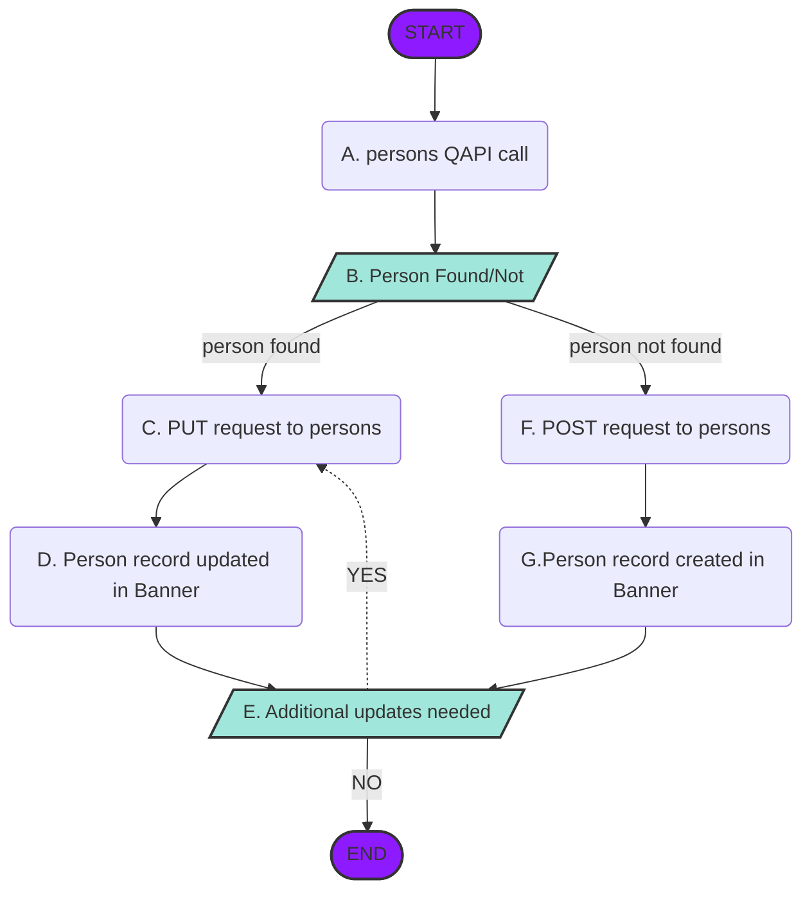

# **Create a Person in Banner Using EEDM APIs** #

The Ethos enabled EEDM APIs can be used to create and/or update a person record in the Banner General system.  The person record created through the persons API is accessible to other systems just as if that person record had been created by an administrator using the Banner user interface.
​
### Prerequisites
The process documented is dependent upon an Ethos Integration tenant configured for your project, user credentials or token for the requesting application established, and appropriate API resources deployed and configured.  Please see the [Getting Started Guide](/get-started/ethos-integration/) for information on setting up Ethos Integration.
​
The Banner EEDM API resources are dependent upon configurations in the Banner system.  These configurations are maintained by Banner administrative users responsible for integration configuration decisions.  A listing of the configurations and additional information for the persons and addresses configuration is available in the [Banner Ethos API User Guide](https://resources.elluciancloud.com/bundle/banner_ethos_api_acn_use_9.24.0/page/c_use_banner_ethos_apis.html).
​
​
### API Resources
#### **Primary**
[persons](/openapi/persons/) 
​
#### **Related**
[addresses](), [address-types](), [alternative-credential-types](), [citizenship-statuses](), [email-types](), [ethnicities](), [gender-identities](), [identity-document-types](), [interests](), [martial-statuses](), [person-name-types](), [personal-prounouns](), [phone-types](), [races](), [religions](), [veteran-statuses]() 
​
​
## **Process:  Create a Person in Banner** ##
​
### Step A:  [persons](/openapi/persons/) QAPI call ###
Banner processes and users create person records for many reasons and the person record is retained indefinitely. It is possible the person record needed already exists in Banner.  To reduce the possibility of creating multiple records for the same person, a QAPI request should always be submitted as the first step when creating a person record.
​
### Step B:  Person Found/Not Found ###
The QAPI will execute user-defined matching rules in Banner and return any person records that match the submitted criteria.  These records can then be reviewed to determine if an existing record should be updated or a new person record created.
​
### Step C:  PUT request to [persons](/openapi/persons/) ###
To update an existing person record, a PUT request to the persons API is used.  Only required properties and any optional properties being updated by the request should be included.  There is no need to include optional properties that are not being updated unless they are part of an array being submitted.
​
#### Java SDK:

    String myApiKey = "someApiKey";
    String resource = "persons";
    // First build a SimpleCriteriaArray filter to get the person.
    CriteriaFilter criteriaFilter = new SimpleCriteria.Builder()
                                               .withSimpleCriteriaArray("names", "lastName", "Smith")
                                               .buildCriteriaFilter();
    EthosProxyClient ethosFilterQueryClient = new EthosClientBuilder(myApiKey).buildEthosFilterQueryClient();
    EthosResponse ethosResponse = ethosFilterQueryClient.getWithCriteriaFilter( resource, criteriaFilter );
    JsonNode personNode = ethosResponse.getContentAsJson();
    String newId = personNode.get("id").asText();
    // Then update the person with changes, and make other changes as needed.
    personNode.put("middleName": "Michael");
    EthosResponse ethosResponse = ethosProxyClient.put("persons", newId, personNode);

#### C# SDK:

    // First build a filter to get the person.
    var criteriaFilterStr = new CriteriaFilter().WithSimpleCriteria("names", ("lastName", "Smith")).BuildCriteria();
    string myApiKey = "someApiKey";
    EthosFilterQueryClient ethosFilterQueryClient = new EthosClientBuilder(someApiKey).WithConnectionTimeout(60).BuildEthosFilterQueryClient();
    EthosResponse ethosResponse = await ethosFilterQueryClient.GetWithCriteriaFilterAsync("persons", criteriaFilterStr);
    // Then update the person with changes, and make other changes as needed.
    JObject personsObject = converter.ToJObjectSingle( ethosResponse );
    personsObject [ "middleName" ] = "Michael";
    string newId = personsObject [ "id" ].ToString();
    EthosResponse personsResponse = await client.PutAsync( "persons", newId, personsObject );
​
### Step D:  Person record update in Banner ###
The persons PUT request will return the full persons data model schema not just the properties included in the update request.
​
### Step E:  Additional updates needed ###
If after review of the response additional person record updates are required simply repeat [Step C](#step-c--put-request-to-persons).
​
### Step F:  Post request to [persons](/openapi/persons/) ###
Use a POST request to the persons API to create a new person record in Banner.  Only required properties are needed to create the person record but for efficiency you may want to include as much optional information as is known.  The record can be updated with additional information at a later time as needed.
​
#### Java SDK:

    String myApiKey = "someApiKey";
    ObjectNode personNode = JsonNodeFactory.instance.objectNode();
    personNode.put("id", "00000000-0000-0000-0000-000000000000");
    personNode.put("firstName": "John");
    personNode.put("lastName": "Smith");
    // Add other fields as needed...
    EthosProxyClient ethosProxyClient = new EthosClientBuilder(myApiKey).buildEthosProxyClient();
    EthosResponse ethosResponse = ethosProxyClient.post("persons", personNode);
    String newId = ethosResponse.getContentAsJson().get("id").asText();

#### C# SDK:
    JObject personObj = new JObject();
    personObj [ "id" ] = "00000000-0000-0000-0000-000000000000";
    personObj [ "firstName" ] = "John";
    personObj [ "lastName" ] = "Smith";
    // Add other fields as needed...
    string myApiKey = "someApiKey";
    EthosProxyClient proxyClient = new EthosClientBuilder(myApiKey).BuildEthosProxyClient();
    EthosResponse response = await proxyClient.PostAsync("persons", personObj);
    JObject personsObject = converter.ToJObjectSingle( response );
    string newId = personsObject [ "id" ].ToString();
	
### Step G:  Person record created in Banner ###
A successful person POST request will return a new guid for the person in addition to the other successfully created detailed information. 
​
​
##Tips for Success  ##
​
​
- Updates to an array are treated as a complete replacement of the array data.  Be sure to include full information for the array properties to include information being updated and current information to be retained.  Failure to include data within an array update is treated as inactivation or delete of the existing information. 
- The institution may choose to map multiple Banner address types to the same addressType enumeration in the persons model schema.  This is an acceptable practice but be aware while submission of multiples of the same addressType is permitted the addresses.type.detail.id must be unique. 
- Use GET requests to [related APIs](#api-resources) to obtain the guids and definitions of properties in the persons model schema.
- The persons API includes default logic to populate some properties even if they are not submitted in the POST request. 
- Not all properties in the schema are allowed to be updated through the persons API.  Examples of data not allowed to be updated include roles and preferred phone properties.
- The [persons-credentials]() API may be used to update alternative credentials for an existing person.  This can be a simplified alternative to using persons when only the alternative credentials require updating.
- The institution may choose to mask some sensitive data within the persons API response even though the data was successfully updated by the POST request.  The header "x-content restricted/partial" denotes when restrictions prevent the API user from receiving the full schema response.
- Subscribe to change notifications for persons to keep your data in sync with Banner.
- Review the [Banner Ethos API Troubleshooting Article](https://ellucian.force.com/clients/s/article/Banner-Ethos-API-troublshooting)

## Want to try the recipe yourself? ##

To jump start your recipe development, download the Ethos SDK code needed to get started with this recipe for the respective SDK implementations.  This requires that your application contains the needed [Ethos Integration SDK](/developer-portal/sdk/) dependencies.

 >####[Download Java SDK recipe code](#)
 >####[Download C# SDK recipe code](#)