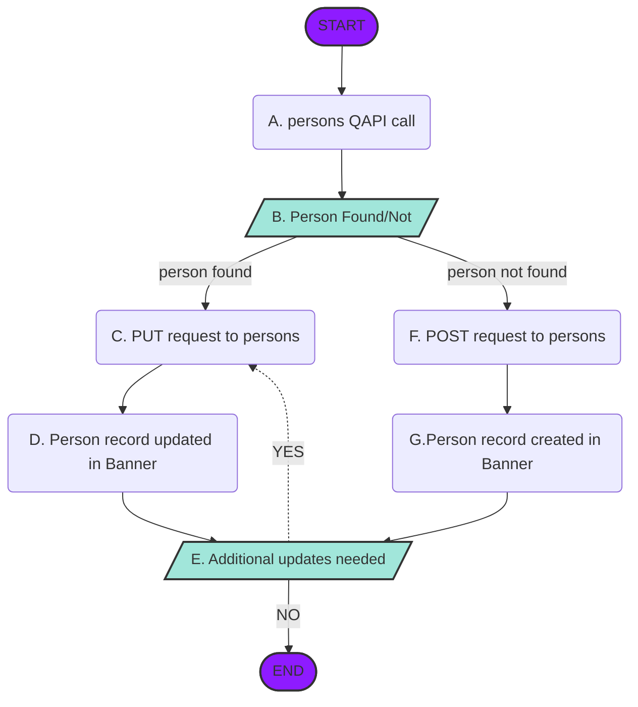

#Update Person

```mermaid
graph TD
    Aid1([START]) -->B(A. persons QAPI call)
    B --> Cid1[/B. Person Found/Not/]
    Cid1 --> |person found| D(C. PUT request to persons)
    Cid1 --> |person not found| E(F. POST request to persons)
    E --> H(G.Person record created in Banner)
    D --> F(D. Person record updated in Banner)
    F --> Gid1[/E. Additional updates needed/]
    H --> Gid1
    Gid1 -.-> |YES| D
    Gid1 --> |NO| Jid1([END])
    %% Class Definitions
    %% =================
    class Aid1,Jid1 cssClass;
    classDef cssClass fill:#8E1BFF,stroke:#333,stroke-width:2px, font-size:15px;
    class Cid1,Gid1 cssClass2;
    classDef cssClass2 fill:#A1E6DA,stroke:#333,stroke-width:2px, font-size:15px;
    class Cid1,Gid1 cssClass3;
    classDef cssClass2 fill:#A1E6DA,stroke:#333,stroke-width:2px, font-size:15px;
```